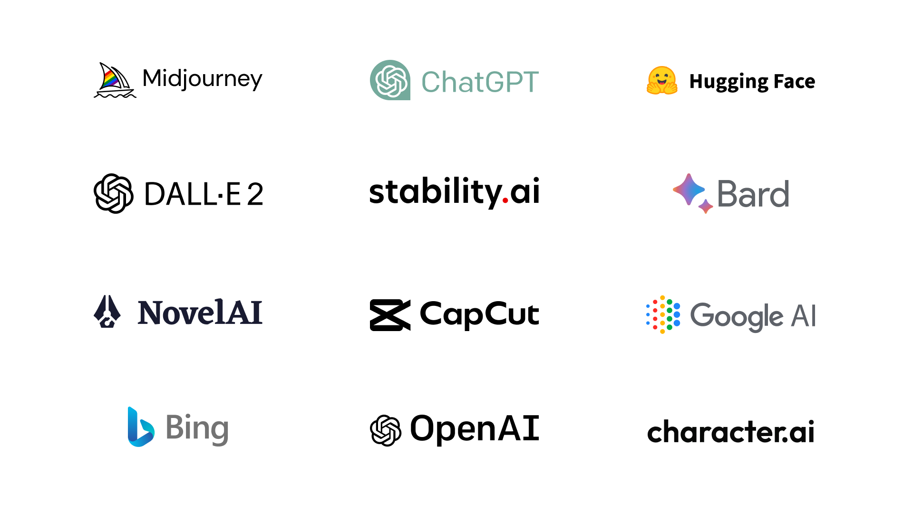
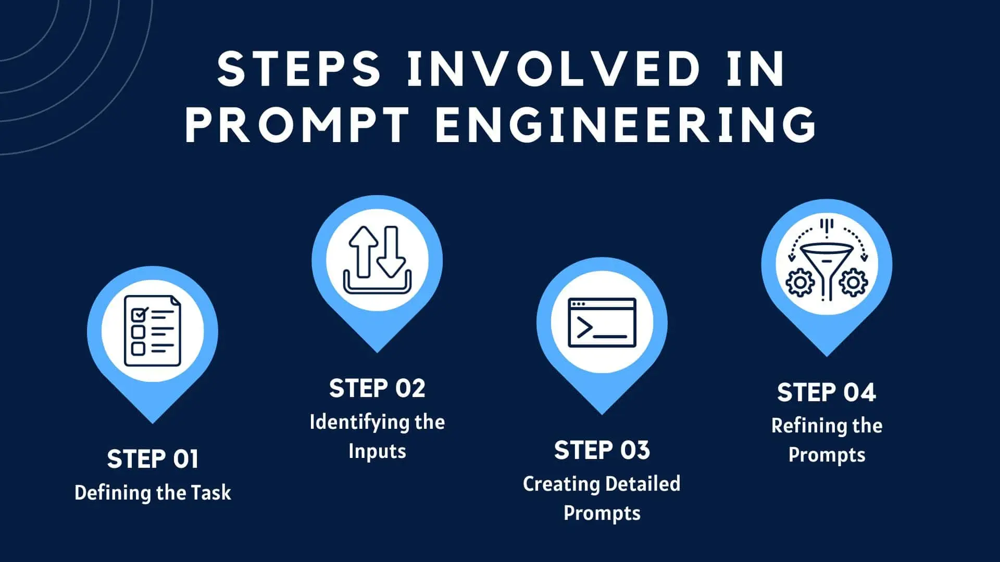

# Các Công Cụ AI Phổ Biến: Vũ Khí Tối Thượng Trong Kỷ Nguyên Số

## 1. Mở đầu: Cơn địa chấn mang tên "Generative AI"

Nếu như Internet thay đổi cách chúng ta kết nối, thì Trí tuệ nhân tạo (AI) đang thay đổi cách chúng ta làm việc. Không còn là những khái niệm xa vời trong phim viễn tưởng, AI hiện nay đã len lỏi vào từng ngóc ngách của cuộc sống, từ việc giải toán, viết code cho đến vẽ tranh nghệ thuật.

Trọng tâm của làn sóng này là **Generative AI (AI tạo sinh)** – các mô hình có khả năng tạo ra dữ liệu mới (văn bản, hình ảnh, âm thanh) dựa trên dữ liệu huấn luyện khổng lồ. Việc nắm bắt các công cụ này không chỉ giúp bạn "qua môn" Tin học 12 mà còn là chìa khóa mở ra cánh cửa nghề nghiệp trong tương lai.

> **Chú thích ảnh:** *Bản đồ hệ sinh thái các công cụ AI năm 2024.*  
> **Mô tả ảnh cho thẻ `alt`:** Hình ảnh đồ họa Infographic đầy màu sắc phân chia các logo của công cụ AI (ChatGPT, Midjourney, Jasper...) thành các nhóm như Text, Image, Video, Code, tạo cảm giác về sự đa dạng và quy mô lớn.

---

## 2. Phân loại các nhóm công cụ AI chủ lực

Để không bị "ngộp" giữa rừng công nghệ, chúng ta có thể chia các công cụ AI phổ biến thành 3 nhóm chính dựa trên chức năng của chúng:

### a. Nhóm xử lý ngôn ngữ tự nhiên (Chatbot & Writing)
Đây là nhóm công cụ nổi tiếng nhất, hoạt động như một "trợ lý ảo" biết tuốt, có khả năng hiểu và phản hồi ngôn ngữ con người một cách mượt mà.

Các đại diện tiêu biểu bao gồm:
*   **ChatGPT (OpenAI):** "Kẻ thay đổi cuộc chơi". Sử dụng mô hình GPT-4, nó có thể viết văn, tóm tắt tài liệu, giải thích khái niệm phức tạp và thậm chí là làm thơ.
*   **Claude (Anthropic):** Đối thủ nặng ký của ChatGPT với khả năng xử lý lượng văn bản đầu vào (context window) cực lớn, văn phong tự nhiên và ít "ảo giác" (hallucination) hơn.
*   **Google Gemini:** Hệ sinh thái AI của Google, tích hợp sâu vào Google Docs, Gmail và có khả năng truy cập Internet theo thời gian thực để lấy thông tin mới nhất.
*   **Notion AI:** Công cụ tuyệt vời cho việc ghi chú, giúp tóm tắt bài học, lên ý tưởng dàn ý và chỉnh sửa văn phong ngay trong trang ghi chú của bạn.

### b. Nhóm sáng tạo hình ảnh (AI Art Generator)
Dành cho những tâm hồn nghệ sĩ nhưng... không biết vẽ. Bạn chỉ cần nhập một đoạn mô tả (prompt), AI sẽ biến nó thành tác phẩm nghệ thuật trong vài giây.

*   **Midjourney:** Hiện là công cụ tạo ảnh đẹp và nghệ thuật nhất, hoạt động trên nền tảng Discord.
*   **Stable Diffusion:** Mã nguồn mở, cho phép cài đặt trực tiếp trên máy tính cá nhân để tùy biến sâu (nhưng yêu cầu card đồ họa mạnh).
*   **Canva Magic Media:** Tích hợp sẵn trong Canva, giúp học sinh tạo ảnh minh họa cho slide thuyết trình cực nhanh.

### c. Nhóm hỗ trợ Lập trình (Coding Assistants)
Đây là "bảo bối" cho dân IT, giúp viết code nhanh hơn và ít lỗi hơn.

*   **GitHub Copilot:** Được mệnh danh là "Lập trình viên đôi" (Pair Programmer). Nó tự động gợi ý code tiếp theo dựa trên ngữ cảnh bạn đang gõ.
*   **Tabnine:** Sử dụng AI để dự đoán dòng code, hỗ trợ hầu hết các IDE phổ biến như VS Code, IntelliJ.

---

## 3. Quy trình 4 bước để làm chủ mọi công cụ AI

Sở hữu công cụ mạnh là một chuyện, biết cách dùng hay không là chuyện khác. Kỹ năng quan trọng nhất khi làm việc với AI chính là **Prompt Engineering** (Kỹ thuật ra lệnh).

Dưới đây là quy trình chuẩn để tối ưu hóa kết quả từ AI:

1.  **Xác định rõ mục tiêu (Define Goal):** Bạn muốn AI làm gì? Đóng vai ai? (Ví dụ: "Hãy đóng vai giáo viên Tin học giải thích về thuật toán sắp xếp...").
2.  **Cung cấp ngữ cảnh (Context):** Cung cấp thông tin nền càng chi tiết càng tốt. AI không thể đọc suy nghĩ của bạn, nó cần dữ liệu đầu vào.
3.  **Tinh chỉnh câu lệnh (Iterate):** Hiếm khi kết quả đầu tiên là hoàn hảo. Hãy yêu cầu AI sửa lại, ví dụ: "Ngắn gọn hơn", "Thêm ví dụ thực tế", "Giọng văn hài hước hơn".
4.  **Kiểm chứng thông tin (Verify):** Đây là bước quan trọng nhất. AI vẫn có thể sai (bịa đặt thông tin). Luôn đối chiếu các số liệu hoặc kiến thức chuyên môn với sách giáo khoa hoặc nguồn chính thống.

> **Chú thích ảnh:** *Mô hình vòng lặp tối ưu hóa câu lệnh (Prompt Loop).*  
> **Mô tả ảnh cho thẻ `alt`:** Sơ đồ quy trình dạng mũi tên tuần hoàn gồm 4 bước: Input (Nhập lệnh) -> AI Processing (Xử lý) -> Output (Kết quả) -> Feedback & Refine (Phản hồi & Tinh chỉnh), minh họa cho việc tương tác liên tục với AI.

---

## 4. Kết luận: AI là công cụ, không phải thợ chính

Sự xuất hiện của các công cụ AI như ChatGPT hay Midjourney không nhằm mục đích thay thế con người, mà là để giải phóng chúng ta khỏi những tác vụ lặp lại nhàm chán.

Trong bối cảnh môn Tin học và tương lai nghề nghiệp, việc bạn biết sử dụng AI để hỗ trợ học tập (như giải thích code, tìm ý tưởng bài văn) là một lợi thế cực lớn. Tuy nhiên, hãy nhớ rằng: **AI là chiếc xe đua F1, còn bạn là tay đua.** Chiếc xe có nhanh đến đâu cũng vô dụng nếu người cầm lái không biết đường đi.

Hãy sử dụng AI một cách thông minh, có đạo đức và luôn giữ vững tư duy phản biện của chính mình.
