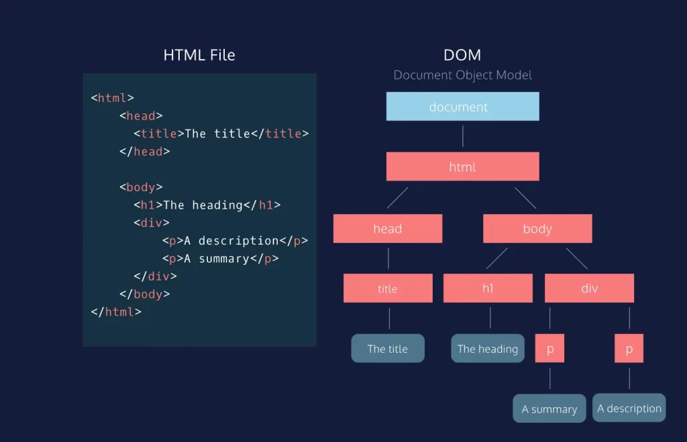

# Cây DOM Là Gì? Xương Sống Của Mọi Trang Web

## 1. Mở đầu: Khi trình duyệt "đọc" mã nguồn

Khi bạn viết xong một file HTML, nó thực chất chỉ là một tập tin văn bản thuần túy (text file). Nhưng khi trình duyệt (Chrome, Edge) mở nó lên, bạn thấy hình ảnh, nút bấm, bố cục. Chuyện gì đã xảy ra ở giữa?

Đó là lúc trình duyệt biến những dòng chữ vô tri thành một cấu trúc sống động gọi là **DOM**. Nếu HTML là bản vẽ kiến trúc, thì DOM chính là ngôi nhà đã được xây dựng xong trong bộ nhớ của máy tính.

---

## 2. DOM: Cây gia phả của thế giới Web

**DOM** viết tắt của **Document Object Model** (Mô hình Đối tượng Tài liệu). Nghe có vẻ "hàn lâm", nhưng thực ra nó hoạt động y hệt một **Cây gia phả (Family Tree)**.

Trong một gia đình, chúng ta có Ông bà, Cha mẹ, Con cái, Anh chị em. Trong HTML cũng vậy:
*   Mọi thẻ đều bắt nguồn từ một "Cụ tổ" duy nhất: `document`.
*   Thẻ `<html>` là "Ông nội" (Root element).
*   Thẻ `<head>` và `<body>` là hai người con của `<html>`. Chúng là anh em ruột (Siblings).
*   Bên trong `<body>` lại có các con cháu như `<h1>`, `<p>`, `<div>`...

Mối quan hệ "Cha - Con" (Parent - Child) này tạo thành một cấu trúc phân cấp hình cây, nên người ta gọi là **DOM Tree**.


> **Chú thích ảnh:** *Sơ đồ minh họa cách trình duyệt chuyển đổi mã HTML thành cây DOM.*  
> **Mô tả ảnh cho thẻ `alt`:** Đồ họa chia làm đôi: Bên trái là các dòng code HTML viết thẳng hàng. Bên phải là sơ đồ cây với các ô tròn (Node) nối với nhau bằng các đường kẻ, ô trên cùng ghi 'Document', tỏa xuống 'HTML', rồi chia nhánh sang 'Head' và 'Body'.

---

## 3. Giải phẫu một Cây DOM qua ví dụ Code

Hãy xem đoạn code HTML đơn giản dưới đây để thấy rõ từng bộ phận của cây:

```html
<!DOCTYPE html>
<html>
  <head>
    <title>Cow IT Wiki</title>
  </head>
  <body>
    <div class="container">
      <h1>Xin chào!</h1>
      <p>Đây là bài viết về DOM.</p>
    </div>
  </body>
</html>
```

Khi trình duyệt đọc đoạn code trên, nó sẽ dựng nên cây DOM như sau:

1.  **Gốc (Root):** Là thẻ `<html>`.
2.  **Cành lớn (Branches):**
    *   Nhánh `<head>` chứa thẻ con `<title>`.
    *   Nhánh `<body>` chứa thẻ con `<div>`.
3.  **Cành nhỏ & Lá (Leaves):**
    *   Thẻ `<div>` là cha của `<h1>` và `<p>`.
    *   Nội dung văn bản bên trong thẻ (ví dụ chữ *"Xin chào!"*) được gọi là **Text Node** - đây chính là những chiếc "lá" cuối cùng của cành cây, không thể mọc thêm nhánh nào nữa.

Mỗi thành phần trên cây (thẻ, thuộc tính, văn bản) được gọi chung là một **Nút (Node)**.

---

## 4. Tại sao Lập trình viên cần quan tâm đến DOM?

Nếu bạn chỉ viết HTML và CSS tĩnh (như dự án Cow IT hiện tại), bạn có thể chưa thấy hết sức mạnh của DOM. Nhưng với một lập trình viên chuyên nghiệp, DOM là "sân chơi" chính.

### a. DOM là cầu nối "Thần thánh"
Đây là điểm quan trọng nhất: **HTML là tĩnh, nhưng DOM thì động.**

Khi bạn muốn trang web thay đổi mà *không cần tải lại trang* (ví dụ: bấm nút "Like" thì số lượt like tăng lên, hoặc bấm vào ảnh thì ảnh phóng to ra), bạn không thể sửa file HTML gốc được. Lúc này, bạn cần một ngôn ngữ lập trình (thường là JavaScript) để tác động vào DOM.

*   **HTML:** Tạo ra cây DOM ban đầu.
*   **JavaScript:** Dùng DOM để thêm cành, bẻ cành, đổi màu lá cây ngay lập tức.

### b. Sức mạnh của sự kiểm soát
Hiểu rõ cấu trúc cây giúp lập trình viên sử dụng CSS và JS hiệu quả hơn:
*   **CSS:** Các bộ chọn (Selectors) như `.container > p` chính là dựa trên mối quan hệ cha-con trong DOM để tô màu chính xác.
*   **JavaScript:** Các lệnh như `document.getElementById('demo')` chính là cách ta đi tìm một chiếc lá cụ thể trong rừng cây rậm rạp để chỉnh sửa nó.
---

## 5. Kết luận: Từ Tĩnh đến Động

Trong phạm vi dự án **Cow IT**, chúng ta đang xây dựng một website tĩnh hoàn toàn bằng HTML/CSS. Điều này có nghĩa là cây DOM của chúng ta được "đúc khuôn" ngay từ khi tải trang và không thay đổi.

Tuy nhiên, việc hiểu bản chất DOM là bước đệm không thể thiếu. Nó giống như việc bạn học giải phẫu cơ thể người trước khi trở thành bác sĩ phẫu thuật vậy. Sau này, khi bạn muốn trang web của mình "biết suy nghĩ" (dùng JavaScript), bạn sẽ thấy DOM chính là công cụ quyền năng nhất trong tay mình.

Hãy nhớ: **"Không có DOM, JavaScript giống như một vị tướng không có quân lính."**
