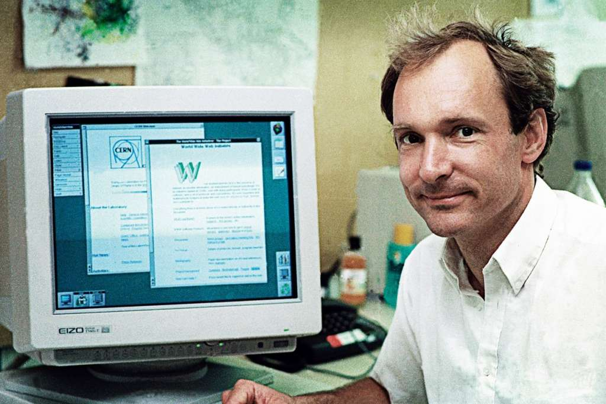

# Sự Ra Đời Của WWW: Khi Thế Giới Được Kết Nối Lại

## 1. Mở đầu: Trước khi có "www"

Hãy thử tưởng tượng một thế giới không có Facebook, không có Google, và dĩ nhiên là không có cả TikTok. Bạn muốn tra cứu thông tin? Hãy đến thư viện. Bạn muốn gửi tài liệu cho đồng nghiệp ở nước khác? Hãy ra bưu điện. Đó chính xác là thế giới trước năm 1989.

Internet đã tồn tại từ những năm 60 (với tên gọi ARPANET), nhưng nó chỉ là một mạng lưới cáp ngầm khô khan nối các máy tính quân sự và đại học lại với nhau. Nó thiếu một "giao diện" để con người có thể lướt đi trên đó. Và rồi, một kỹ sư người Anh tại CERN (Tổ chức Nghiên cứu Hạt nhân Châu Âu) đã thay đổi tất cả.

---

## 2. Tim Berners-Lee và chiếc máy tính NeXT huyền thoại

Vào cuối thập niên 80, **Tim Berners-Lee** nhận thấy một vấn đề nhức nhối tại CERN: Các nhà khoa học đến từ khắp nơi trên thế giới mang theo những loại máy tính khác nhau, phần mềm khác nhau. Họ không thể chia sẻ dữ liệu nghiên cứu một cách dễ dàng.

Tim nảy ra ý tưởng về một hệ thống thông tin toàn cầu, nơi các tài liệu được liên kết với nhau bằng các "siêu liên kết" (hypertext). Ông gọi dự án này là **World Wide Web**.

Trên chiếc máy tính NeXT Cube (một sản phẩm của Steve Jobs khi rời Apple), Tim đã viết nên 3 công nghệ nền tảng mà chúng ta vẫn dùng đến tận ngày nay:
1.  **HTML:** Ngôn ngữ đánh dấu để tạo nên trang web.
2.  **URI (sau này là URL):** Địa chỉ để tìm trang web.
3.  **HTTP:** Giao thức để gửi và nhận trang web.

> **Chú thích ảnh:** *Chiếc máy tính NeXT của Tim Berners-Lee tại CERN – Máy chủ Web (Web Server) đầu tiên trên thế giới.*  
> **Mô tả ảnh cho thẻ `alt`:** Hình ảnh một chiếc máy tính khối vuông màu đen cũ kỹ, trên vỏ máy có dán một tờ giấy viết tay dòng chữ cảnh báo đỏ: "This machine is a server. DO NOT POWER IT DOWN!!" (Máy này là máy chủ. CẤM TẮT NGUỒN!!).

Ngày 06/08/1991, trang web đầu tiên trên thế giới chính thức được đưa lên mạng (online). Nó cực kỳ đơn sơ, chỉ toàn chữ đen trên nền trắng, hướng dẫn mọi người cách sử dụng Web. Nhưng đó là tia lửa khởi đầu cho vụ nổ Big Bang về thông tin.

Một câu nói nổi tiếng của Tim Berners-Lee đã trở thành kim chỉ nam cho sự phát triển của Web sau này:

> *"Sức mạnh của Web nằm ở tính phổ quát của nó. Việc mọi người có thể truy cập bất kể họ đang dùng phần cứng gì, phần mềm gì hay ngôn ngữ nào... là điều cốt yếu."*  
> — **Sir Tim Berners-Lee**

---

## 3. Internet và WWW: Hai khái niệm hoàn toàn khác nhau

Rất nhiều người (thậm chí cả dân IT mới vào nghề) thường dùng lẫn lộn hai từ "Internet" và "World Wide Web". Thực tế, chúng là hai thứ riêng biệt.

Hãy hình dung thế này cho dễ hiểu:
*   **Internet** là **cơ sở hạ tầng** (như hệ thống đường xá, cầu cống, cáp quang dưới biển). Nó kết nối các máy tính lại với nhau về mặt vật lý.
*   **World Wide Web (WWW)** là **dịch vụ chạy trên đó** (như những chiếc xe hơi, cửa hàng, siêu thị vận hành trên con đường đó).

Nếu Internet là phần cứng của mạng lưới, thì Web là phần mềm giúp chúng ta xem nội dung. Chúng ta dùng Internet để truy cập Web, nhưng Internet còn dùng để gửi Email, truyền tải File (FTP) hay chơi game Online mà không cần trình duyệt.

> **Định nghĩa kỹ thuật:**  
> *"World Wide Web (WWW) là một không gian thông tin toàn cầu mà mọi tài liệu và nguồn tài nguyên khác được định danh bằng URL, liên kết với nhau bởi các siêu liên kết (hyperlinks) và có thể truy cập thông qua mạng Internet."*

---

## 4. Di sản và Tương lai

Từ trang web đơn sơ năm 1991, World Wide Web đã phát triển rực rỡ qua các giai đoạn:
*   **Web 1.0:** Web tĩnh, chỉ đọc (như trang báo giấy điện tử).
*   **Web 2.0:** Web tương tác, mạng xã hội (nơi người dùng tạo ra nội dung).
*   **Web 3.0:** Web ngữ nghĩa và phi tập trung (tương lai đang hướng tới).

Ngày nay, khi bạn đang đọc bài viết này, trình duyệt của bạn vẫn đang âm thầm thực hiện đúng những gì Tim Berners-Lee đã thiết kế cách đây hơn 30 năm: Gửi một yêu cầu HTTP, nhận về mã HTML và hiển thị nó lên màn hình.

Hiểu về nguồn gốc của Web giúp chúng ta trân trọng những dòng code mình viết ra. Mỗi thẻ `<a>` bạn gõ xuống không chỉ là một liên kết, nó là sự kết nối tri thức nhân loại.
